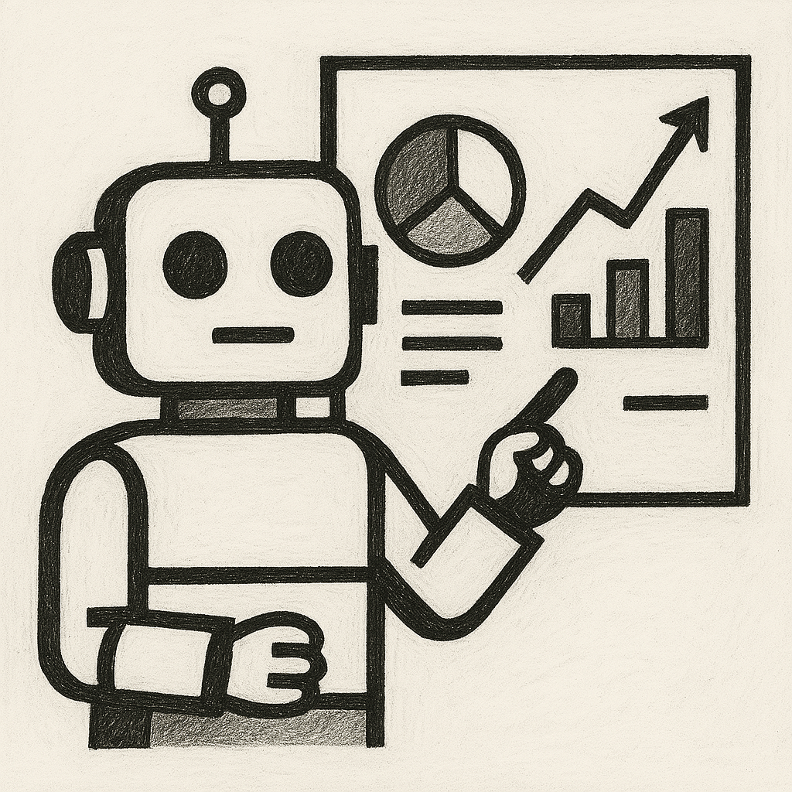
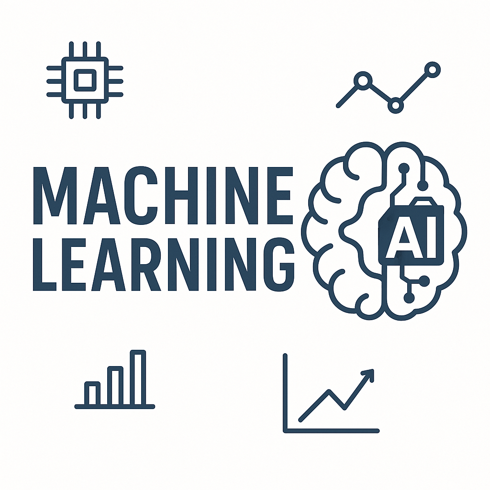

```{r setup, include=FALSE}
knitr::opts_chunk$set(echo = TRUE)
```

<!-- <div style="display: flex; justify-content: center; gap: 20px;"> -->

<!--    -->

<!--    -->

<!-- </div> -->


```{r side-by-side-images, echo=FALSE, out.width="95%", fig.align='center'}
# Read in the images
library(gridExtra)
library(png)
library(grid)
img1 <- readPNG("P1.png")
img2 <- readPNG("P2.png")

# Create raster grobs
g1 <- rasterGrob(img1, interpolate = TRUE)
g2 <- rasterGrob(img2, interpolate = TRUE)

# Create grobs with captions
caption1 <- textGrob(
  "ChatGPT explaining how it would teach this course —\nconfidently, as if it wrote the syllabus.",
  gp = gpar(fontsize = 10),
  just = "center"
)

caption2 <- textGrob(
  "I ask ChatGPT to visualize my teaching —\nstats, machine learning, and a dash of chaos.",
  gp = gpar(fontsize = 10),
  just = "center"
)

grid.arrange(
  arrangeGrob(g1, caption1, ncol = 1, heights = unit(c(4, 2), "null")),
  arrangeGrob(g2, caption2, ncol = 1, heights = unit(c(4, 2), "null")),
  ncol = 2,
  padding = unit(1, "cm")
)
```


Welcome to the course website for __STA314__ (Statistical Methods for Machine Learning I). This course is offered by the department of [Statistical Sciences](http://utstat.toronto.edu). 

Machine learning (ML) is a set of techniques that allow computers to learn from data and experience, rather than requiring humans to specify the desired behaviour by hand. ML has become increasingly central both in statistics as an academic discipline, and in the data science industry. This course provides a broad introduction to commonly used ML methods, as well as the key statistical concepts underlying ML. It serves as a foundation for more advanced courses, such as STA414 (Statistical Methods for Machine Learning II).

We will cover statistical methods for supervised and unsupervised learning from data: training error, test error and cross-validation; classification, regression, and logistic regression; stochastic gradient descent' principal components analysis; decision trees and random forests; k-means clustering and nearest neighbour methods; and building a nano-scale GPT model if time permitted. Computational tutorials will support the efficient application of these methods.


<!-- __Prerequisites__ -->

<!-- Undergraduate-level understanding of  -->

<!-- - Advanced calculus (eg. MAT237) -->
<!-- - Linear algebra (eg. MAT223, MAT224). -->

<!-- A previous course in probability and/or statistics is expected.  Prerequisites will not be waived.  Enrollment is restricted to graduate students in Statistics, Biostatistics, and Computer Science. -->

<!-- __Overview__ -->

<!-- Review of probability theory, convergence of random variables, statistical models, statistical functionals, maximum likelihood estimation, and computational methods. -->


<!-- Important information related to STA2112 will be posted on this website including: -->

<!--  - [Course syllabus](syllabus.html) -->

<!--  - [Lecture Notes](class_docs.html)  -->

<!--  - [Tutorial Problem Sets](tut_docs.html) -->
 
 ******
<br>

<a rel="license" href="http://creativecommons.org/licenses/by-nc-sa/4.0/"></a><br />This website is licensed under a <a rel="license" href="http://creativecommons.org/licenses/by-nc-sa/4.0/">Creative Commons Attribution-NonCommercial-ShareAlike 4.0 International License</a>.


